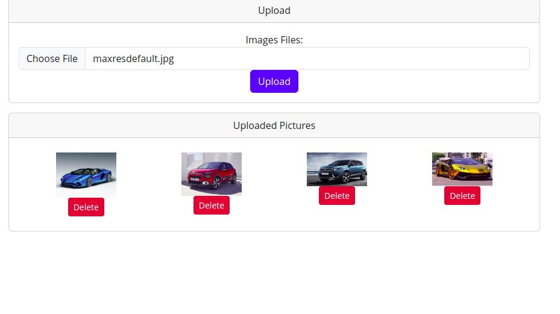
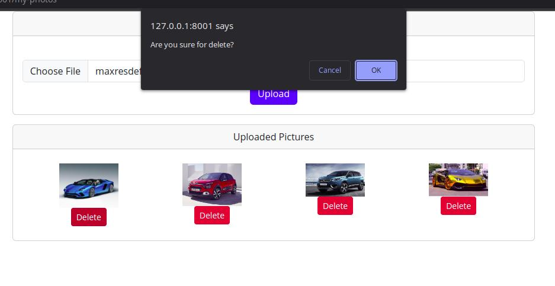
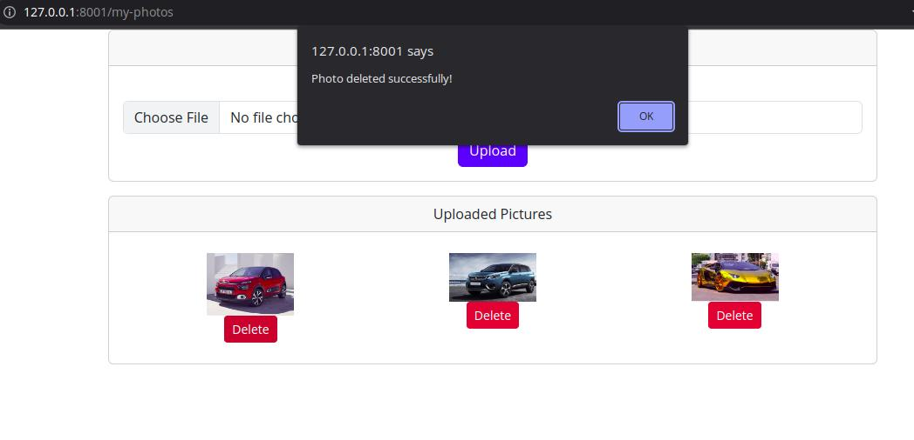

# photo-upload-with-laravel
Photo upload with laravel 9

## Please do step by step

```
composer install
cp .env.example .env
php artisan key:generate

```
## Please update database settings in .env

```
DB_CONNECTION=mysql
DB_HOST=127.0.0.1
DB_PORT=3306
DB_DATABASE=laravel
DB_USERNAME=root
DB_PASSWORD=
```

## After change it please follow this

```
php artisan migrate
php artisan serve
```

# Api informations

```
GET : http://127.0.0.1:8001/api/photos
```
Returns all photos with this url.

```
status : true
```

Other photos returning datas;

```
id : photo record id
path: photo url
order: photos index for sorting
created_at: created time and uploaded time
updated_at: updated time
```


# Some Screenshots







